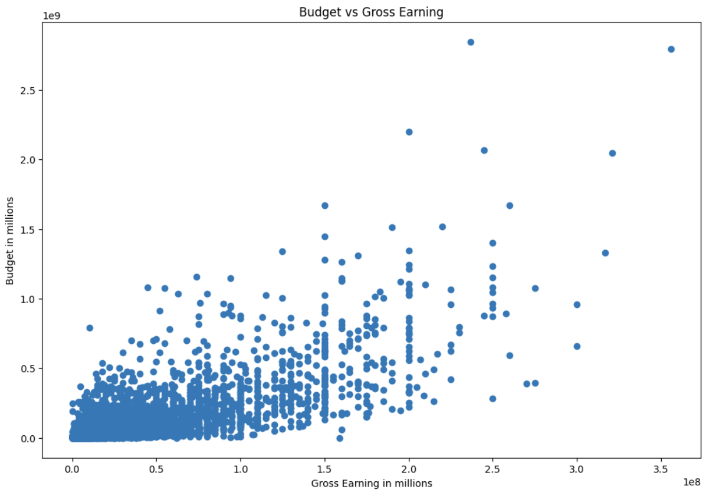

# Movie Industry Correlation Analysis

This Jupyter Notebook performs an analysis of the movie industry to explore the correlation between different factors, particularly focusing on the relationship between movie budgets and gross earnings.

In this project, we'll use pandas to read a CSV file containing movie information from 1980 to 2020, featuring films from around the world. Our goal is to analyze correlations between various factors such as name, rating, genre, year, release date, score, votes, director, writer, star, country, budget, gross revenue, production company, and runtime.

## Overview

This notebook aims to answer the following key questions:
- Which films generated the highest gross revenue?
- Is there a correlation between a movie's budget and its gross earnings?

The analysis includes:
- Data loading and initial exploration
- Data cleaning and preprocessing
- Visualization of relationships between variables
- Calculation of correlations using Pearson, Kendall, and Spearman methods

## Setup Instructions

### Prerequisites

Ensure you have Python installed on your system along with the following packages:
- `pandas`
- `numpy`
- `matplotlib`
- `seaborn`

### Running the Notebook

1. Clone this repository or download the notebook file.
2. Place the `Movies Data.csv` file in the same directory as the notebook.
3. Open the notebook and execute the cells sequentially.

### Data

The dataset used in this analysis is stored in a CSV file named `Movies Data.csv`, which contains the following key columns:
- `name`: The name of the movie.
- `director`: The director of the movie.
- `budget`: The budget of the movie.
- `gross`: The gross earnings of the movie.
- `released`: The release date of the movie.

## Analysis

### Data Cleaning

- Missing values were checked and appropriate data types were assigned to relevant columns.
- A new column `year` was created by extracting the year from the `released` column.

## Visualizations

#### ScatterPlot using Matplotlib

- Scatter plots and regression plots were used to visualize the relationship between movie budgets and gross earnings.

#### ScatterPlot using Seaborn

- Positive correlation was observed between budget and gross earnings.

### Correlation Analysis

Three methods were employed to assess correlations:
1. **Pearson Correlation**: Measures linear relationships between variables.
2. **Kendall's Tau**: Assesses the strength of dependence between variables based on ranks.
3. **Spearman's Rank Correlation**: Evaluates how well the relationship between two variables can be described by a monotonic function.

## Conclusion

The analysis concludes that there is a positive correlation between a movie's budget and its gross earnings, indicating that higher budgets often lead to higher gross revenues.
